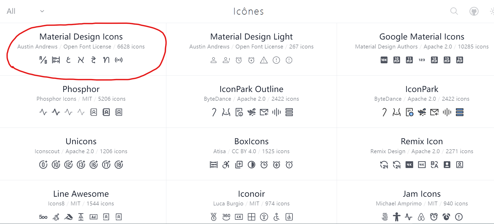
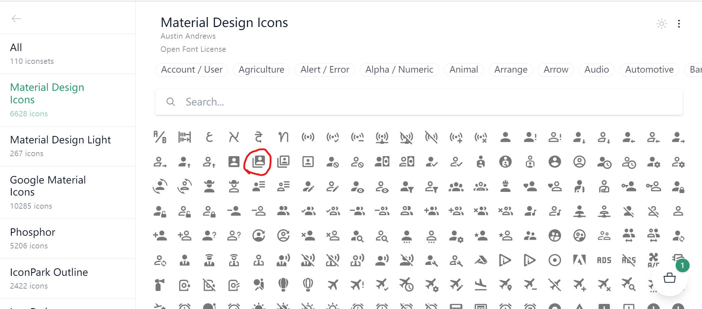
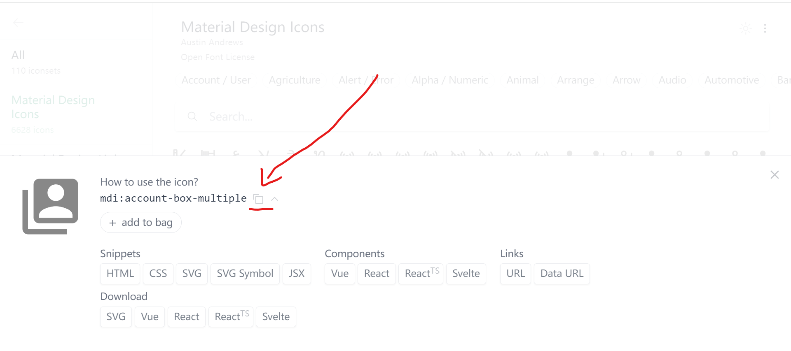

<div align="center">
    
    <h1>
		<a href="https://github.com/liaoyio/yi-template" target="_blank">Yi-template</a>
	</h1>
    <p>vite + vue3 + ts 开箱即用现代开发模板</p>
</div>

<br />
<br />

## 特点 💫

1. Vite4 
2. Vue3
5. Mock 支持
6. Api 自动引入
7. 组件自动引入
8. 图标自动引入
9. VueUse 支持
10. TypeScript
11. UnoCss
12. 暗黑模式支持
13. SWR 请求支持
14. pinia 状态管理
15. pnpm 包管理器
16. 跳转进度条支持
17. 开发面板支持
18. 插件自动加载支持
19. Vitest 单元测试支持
20. 支持 Markdown 渲染
21. 路径别名 `~@` 支持
22. 命令行自动创建与删除
23. i18n 国际化支持
24. 漂亮的 404 页支持
25. tsx 支持
26. gzip 资源压缩支持
27. 环境变量配置支持
28. 统一的代码规范与风格支持
29. 生产环境自动移除开发日志
30. defineOptions 支持
31. echarts 支持
32. 全局通用 toast 通知
33. 全局通用 axios 请求封装
34. 自动生成环境变量类型声明
35. `renovate` 自动更新依赖
36. 自动版本更新并生成 `CHANGELOG`

<br />
<br />

## 克隆模板 🦕

1. Github

```shell
git clone git@github.com:liaoyio/yi-template.git
```


4.  `Github` 仓库 👉
   [Use this template](https://github.com/liaoyio/yi-template)

<br />
<br />
<br />

## `node` 版本推荐 🐎

因为该模板完全面向现代，所以推荐大家使用 `node` 当前的长期维护版本 `v18`

<br />
<br />
<br />

## 使用 🐂

该模板仅支持 `pnpm` 包管理器 👉 [安装教程](https://pnpm.io/zh/installation)

1. 安装依赖

```shell
pnpm install
```

2. 开发

```shell
pnpm dev

# 开启 host
pnpm dev:host

# 自动打开浏览器
pnpm dev:open
```

3. 预览

```shell
pnpm preview

# 开启 host
pnpm preview:host

# 自动打开浏览器
pnpm preview:open
```

4. 打包

```shell
pnpm build

pnpm build:debug
```

5. 单元测试

```shell
pnpm test
```

6. 单元测试报告生成

```shell
pnpm coverage
```

7. 类型检查

```shell
pnpm typecheck
```

8. 自动创建

```shell
pnpm auto:create
```

9. 自动移除

```shell
pnpm auto:remove
```

10. 依赖更新

```shell
# 依赖版本更新
pnpm deps:fresh
```

```shell
# 以上命令仅对包信息 package.json 进行写入，需要重新执行包安装命令
pnpm i
```

11. 代码规范校验

```shell
pnpm lint

# 校验时修复
pnpm lint:fix
```

<br />
<br />

## 动机 🐗

为什么要做这个 **模板** 呢？

1. 为下次开发节省浪费在配置上的时间
2. 结合主流插件整合现代开发架构，提高开发效率

<br />
<br />

## 使用场景 🐻

什么时候你应该用?

1. 不想浪费时间在项目配置上
2. 希望尝试用更现代的方式开发 `web` 应用，提高开发效率

<br />
<br />

## 启发 🐃

该模板受 **[vitesse](https://github.com/antfu/vitesse)** 启发，如果你有 `SSG`
的场景，推荐你使用 **[vitesse](https://github.com/antfu/vitesse)**。

<br />
<br />

## 详情 🐳

### [1. Vite ](https://cn.vitejs.dev/)

该模板采用 **[vite](https://cn.vitejs.dev/)** 作为构建工具，你可以在根目录下的
`vite.config.ts` 对项目的构建进行配置。

对于众多主流插件的引入和繁杂配置已经整合到根目录下的预设 `presets`
中，大多数情况下你是不需要重新对它们进行配置的。

<br />

### [2. Vue3](https://v3.cn.vuejs.org/)

<br />


### [3. Mock 支持](https://github.com/vbenjs/vite-plugin-mock)

在根目录下的 `mock` 目录下，可以在模块中导出默认的 `api` 资源。

例如 `mock/test.ts` 内导出

```ts
import { MockMethod } from "vite-plugin-mock";
export default [
  {
    url: "/api/mock/get",
    method: "get",
    response: () => {
      return {
        code: 0,
        data: {
          name: "vben",
        },
      };
    },
  },
] as MockMethod[];
```

在 `src` 中就可以进行模拟请求。

```html
<script setup lang="ts">
	import { useRequest } from 'vue-request'
	// 请求接口 /api/get
	const { data, loading, error } = useRequest('/api/mock/get')
</script>

<template>
	<div>data: {{data}}</div>
	<div>loading: {{loading}}</div>
	<div>error: {{error}}</div>
</template>
```

这里用到 [vue-request](https://cn.attojs.org/) 去做请求，不过因为该 `mock`
拦截的是一整个接口，所以换成 `axios` 等请求库也是可以的。

更多 `mock` 设置可见 👉
[vite-plugin-mock](https://github.com/vbenjs/vite-plugin-mock)

<br />

### [4. Api 自动引入](https://github.com/antfu/unplugin-auto-import)

原本 `vue` 的 `api` 需要自行 `import`。

```ts
import { computed, ref } from "vue";
const count = ref(0);
const doubled = computed(() => count.value * 2);
```

现在可以直接使用。

```ts
const count = ref(0);
const doubled = computed(() => count.value * 2);
```

而且上边的 `api` 是按需自动引入的。

目前模板支持自动引入 `api` 的库列表 👉

- `vue`
- `vuex`
- `pinia`
- `vue-i18n`
- `vue-router`
- `@vueuse/core`
- `@vueuse/head`
- `@vueuse/math`

只要确保已经安装依赖即可，具体可见 👉
[vite-auto-import-resolvers](https://github.com/dishait/vite-auto-import-resolvers#%E9%BB%98%E8%AE%A4%E6%94%AF%E6%8C%81%E5%88%97%E8%A1%A8)，

当然还有项目中的自动引入，只需要满足以下规范即可。

1. `src/composables` 的导出将被按需自动引入。

例如有个 `src/composables/foo.ts`

```ts
// default 导出
export default 1000;
```

此时就不再需要 `import`了

```html
<script setup lang="ts">
	console.log(foo) // 输出 1000
</script>

<template>
	<div @click="store.inc()">{{store.counter}}</div>
</template>
```

2. `src/stores` 的导出将被按需自动引入。

例如有个 `src/stores/counterStore.ts`

```ts
// default 导出
export default defineStore("counter", {
  state() {
    return {
      counter: 1,
    };
  },
  actions: {
    inc() {
      this.counter++;
    },
  },
});
```

此时就不再需要 `import`了

```html
<script setup lang="ts">
	const store = counterStore()
</script>

<template>
	<div @click="store.inc()">{{store.counter}}</div>
</template>
```

3. `src/api` 也是自动按需导入，与上述类似

具体可见 👉
[unplugin-auto-import](https://github.com/antfu/unplugin-auto-import)。

<br />

### [5. 组件自动引入](https://github.com/antfu/unplugin-vue-components)

原来需要 `import`

```html
<!-- src/pages/index.vue -->
<script setup lang="ts">
	import Hello from '../components/Hello.vue'
</script>

<template>
	<Hello />
</template>
```

现在只要在 `src/components` 下定义的组件都将会按需引入，即 `import` 是不需要的。

```html
<!-- src/pages/index.vue -->
<template>
	<Hello />
</template>
```

当然也支持嵌套组件，例如 `src/components/foo/bar.vue` 👇

```html
<!-- src/pages/index.vue -->
<template>
	<FooBar />
</template>
```


```html

<template>
	<!-- `src/components/ts/modal.vue` -->
	<TsModal />
	<!-- `src/components/ts/empty/not.vue` -->
	<TsEmptyNot />
</template>
```

同时流行组件库自动引入也是支持的，例如 `Naive ui`。

只需安装依赖。

```shell
pnpm add element-plus
```

即可在模板中使用。

```html
<!-- src/pages/index.vue -->
<template>
	<el-button type="success">Success</el-button>
</template>
```

目前已经配置自动导入的组件库有(请提前下载依赖包):

- [element-plus](https://github.com/element-plus/element-plus)
- [ant-design-vue](https://github.com/vueComponent/ant-design-vue)
- [tdesign-vue-next](https://github.com/Tencent/tdesign-vue-next)
- [@vueuse/components](https://github.com/vueuse/vueuse/tree/main/packages/components)


具体可见 👉
[unplugin-vue-components](https://github.com/antfu/unplugin-vue-components)

<br />

### [6. 图标自动引入](https://unocss.dev/presets/icons)

可前往 👉 [icones](https://icones.netlify.app/)，随意选择点击进入其中一个图标库



再点击选择其中一个喜欢的图标



复制其名称



在模板中即可通过 `class` 的方式直接使用，注意加上前缀 `i-`。

```html
<template>
	<div class="i-mdi:account-box-multiple"></div>
</template>
```

保存后等待自动下载该图标库后，就可以在页面中看到对应图标。

同时推荐你使用 `vscode` 插件
[Iconify IntelliSense](https://marketplace.visualstudio.com/items?itemName=antfu.iconify)。

该插件会在模板中显示图标的预览。

当然图标动态加载也是支持的 👇

```html
<script>
	const icon = ref("i-ep:arrow-left")

	// 两秒后换成另一个图标
	setTimeout(() => {
		icon.value = 'i-icon-park-outline:arrow-circle-down'
	}, 2000)
</script>

<template>
	<div :class="icon"></div>
</template>
```


具体可见 👉 [unocss/presets/icons](https://unocss.dev/presets/icons)


SVG图标也是支持的，只需将 `svg` 文件放在 `src/assets/svg` 下即可。

```html
<template>

	<icon-ep:arrow-down-bold />
	<icon-ep:arrow-up-bold />

	<!-- `src/assets/svg/notice.svg` -->
	<icon-svg-notice class="svg_icon" />
	<!-- `src/assets/svg/question.svg` -->
	<icon-svg-question class="svg_icon" />
</template>
```

**注意:**

- 动态图标，请确保在开发环境下所有的图标都测过一遍。
- tsx文件中也无法使用 vue插件提供的自动导入图标方式。


<br />

### [7. VueUse 支持](https://vueuse.org/)

`VueUse` 是一个超级强的 `hooks` 库，例如你要获取鼠标位置，只需要这样 👇

```html
<script setup lang="ts">
	// useMouse 被自动按需引入了，不需要import
	const { x, y } = useMouse()
</script>

<template>
	<div>x坐标 {{x}}</div>
	<div>y坐标 {{y}}</div>
</template>
```

具体可见 👉 [VueUse](https://vueuse.org/)

<br />

### [8. TypeScript ](https://www.tslang.cn/)

不需要重新配置，直接用 `ts` 书写就行了。

<br />

### [9. unocss ](https://unocss.dev/)

`unocss` 是一个开发中速度更快的 `原子css` 库。

直接在模板中用就行了，不需要配置。

```html
<template>
	<div class="bg-red-500 text-white">我是红色背景的白色文本</div>
</template>
```

上述模板将渲染红色背景白色的字。

同时支持
[属性化模式](https://unocss.dev/presets/attributify)，即可以用简写。

```html
<template>
	<div text="white" bg="red-500">我是红色背景的白色文本</div>
</template>
```

这在调整边距尺寸以及等方面可以减少代码量。

具体可见 👉 [unocss](https://unocss.dev/)

<br />

### [10. 暗黑模式支持](https://github.com/dishait/vue-dark-switch)

暗黑模式由 [vue-dark-switch](https://github.com/dishait/vue-dark-switch) 实现。

```html
<script setup>
import { SwitchIcon } from "vue-dark-swicth"
</script>

<template>
	<!-- 暗黑 switch，一键切换暗黑模式 -->
	<SwitchIcon /> 
</template>
```

具体可见 👉 [vue-dark-switch](https://github.com/dishait/vue-dark-switch)

<br />

### [11. SWR 请求支持](https://cn.attojs.org/)

SWR 是更现代的请求方式，具体可见文章 👉
[SWR](https://zhuanlan.zhihu.com/p/89570321)。

而 [vue-request](https://cn.attojs.org/) 是一个 `SWR` 的 `Vue` 版本请求库。

你可以这样用，例如请求 `/api/test`

```html
<script setup lang="ts">
	import { useRequest } from 'vue-request'
	const { data, loading, error } = useRequest('/api/test')
</script>

<template>
	<div>data: {{data}}</div>
	<div>error: {{error}}</div>
	<div>loading: {{loading}}</div>
</template>
```

所有基本的数据，状态和缓存都帮你搞定了，不需要重新封装。

具体可见 👉 [vue-request](https://cn.attojs.org/)

<br />

### [12. pinia 状态管理](https://pinia.vuejs.org/)

`pinia` 是下一代的状态管理库，比 `vuex` 更简单，`ts` 支持更好。

你可以在 `src/stores` 中进行状态的定义。

例如创建 `src/stores/counter.ts` 👇

```ts
// src/stores/counter.ts
import { defineStore } from "pinia";

export const useCounterStore = defineStore("counter", {
  state() {
    return { count: 0 };
  },
  actions: {
    inc() {
      this.count++;
    },
  },
});
```

定义完后在 `setup` 中直接使用即可

```html
<!-- src/pages/index.vue -->
<script setup lang="ts">
    const Counter = useCounterStore()
<script>

<template>
    <div @click="Counter.inc">{{Counter.count}}</div>
</template>
```

更多具体使用可见 👉 [pinia](https://pinia.vuejs.org/)

<br />

### [13. pnpm 包管理器](https://pnpm.io/zh/)

`pnpm` 是非常优秀的包管理器，更快、更节省空间、更合理。

具体可见 👉 [pnpm](https://pnpm.io/zh/)

<br />

### [14. 跳转进度条支持](https://github.com/rstacruz/nprogress)

跳转进度条由 `nprogress` 实现，可在`src/styles/main.css` 中调整配色。

```css
/** src/styles/main.css **/

/** 省略其他样式 **/
#nprogress .bar {
	@apply bg-blue-700 bg-opacity-75; /** 配色 **/

	position: fixed;
	z-index: 1031;
	top: 0;
	left: 0;

	width: 100%;
	height: 2px;
}
```

关于 `@apply` 由[@unocss/transformer-directives](https://www.npmjs.com/package/@unocss/transformer-directives)
实现。

具体可见 👉 [nprogress](https://github.com/rstacruz/nprogress)

<br />

### [15. 开发面板支持](https://github.com/webfansplz/vite-plugin-vue-devtools)

该面板可以让你在开发过程中，了解项目的方方面面，目前仅在开发环境下有效

具体可见 👉
[vite-plugin-vue-devtools](https://github.com/webfansplz/vite-plugin-vue-devtools)

<br />

### [16. 插件自动加载支持](https://github.com/dishait/vite-plugin-use-modules)

只需要在 `src/plugins` 中的模块里导出默认函数即可。

例如 `pinia`，只需要这样做。

```ts
// src/plugins/pinia.ts
// 导出 default 接口
export default createPinia(); // pinia 将被自动安装
```

或者 `vue-router`

```ts
// src/plugins/router.ts
// 省略各种配置

// 导出 default 接口
export default router; // 路由将被自动安装
```

当然 `pinia` 和 `vue-router` 已经预设好了，你不需要重新关注他们。

具体可见 👉
[vite-plugin-use-modules](https://github.com/dishait/vite-plugin-use-modules)

<br />

### [17. Vitest 单元测试支持](https://vitest.dev/guide/#configuring-vitest)

在 `src/test` 目录中可以书写单元测试。

```ts
import { assert, describe, expect, it } from "vitest";

describe("suite name", () => {
  it("foo", () => {
    expect(1 + 1).toEqual(2);
    expect(true).to.be.true;
  });

  it("bar", () => {
    assert.equal(Math.sqrt(4), 2);
  });

  it("snapshot", () => {
    expect({ foo: "bar" }).toMatchSnapshot();
  });
});
```

然后在终端中输入命令即可测试

```shell
pnpm test
```

或者生成报告

```shell
pnpm coverage
```

具体可见 👉 [Vitest](https://vitest.dev/guide/#configuring-vitest)

<br />

### [18. 支持 Markdown 渲染](https://github.com/antfu/vite-plugin-vue-markdown)

`markdown` 渲染可以用来书写一些简单的说明。

只需要把 `src/pages` 目录下的页面后缀由 `.vue` 改为 `.md`，然后再改为 `markdown`
语法即可。

例如 `src/pages/about.md`

```md
## About Page

> The page is markdown file
```

当你路由到 `/about` 后即可看到对应的 `markdown` 渲染。

当然也支持在 `markdown` 中嵌入 `vue` 组件

具体可见 👉
[vite-plugin-vue-markdown](https://github.com/antfu/vite-plugin-vue-markdown)

<br />
<br />

### 19. 路径别名 `~` 支持

`~@` 路径将被导向项目的 `src` 目录，同时有更好的类型提示

```html
<!-- src/pages/index.vue -->
<script lang="ts" setup>
	import { useDarks } from '~/composables/dark'

	// 等价于
	// import { useDarks } from "../composables/dark"
</script>
```

<br />
<br />

### 20. 命令行自动创建与删除

只要输入 👇，即可创建一个标准的页面或组件

```shell
pnpm auto:create
```

当然也可以进行删除 👇

```shell
pnpm auto:remove
```

<br />
<br />

### [21. i18n 国际化支持](https://github.com/intlify/bundle-tools/tree/main/packages/vite-plugin-vue-i18n)

在日常的业务当中，可能会存在一些需要国际化的场景。那么只需要在根目录下的
`locales` 中定义不同语言的 `yml` 即可在项目中做到开箱即用的国际化支持。

比如 `locales/en.yml` 中用来定义需要国际化支持的英文内容。

```yml
# locales/en.yml
# English

index: index
about: about
not-found: Notfound
```

又如 `locales/简体中文.yml` 中用来定义需要国际化支持的中文内容。

```yml
# locales/简体中文.yml
# 中文

index: 主页
about: 关于
not-found: 未找到页面
```

此时在组件中即可这样用 👇

```html
<script setup>
	// 该api是全局按需引入的，所以可以直接用
	// t 用来绑定特定的语块
	const { t, locale } = useI18n()

	const toggleLocale = () => {
		// locale.value 用来表示当前所属语言，可修改进行语言切换
		locale.value = locale.value === '简体中文' ? 'en' : '简体中文'
	}
</script>

<template>
	<div m="6" cursor="pointer" @click="toggleLocale()">
		language: {{ t('index') }} click me!!
	</div>
</template>
```

更详细的说明可见用到的 `vite 插件` 👉
[@intlify/vite-plugin-vue-i18n](https://github.com/intlify/bundle-tools/tree/main/packages/vite-plugin-vue-i18n)
与 `vue插件` [vue-i18n](https://github.com/intlify/vue-i18n-next)。

另外 `yml` 是目前前端中流行的配置文件格式，语法可见阮一峰先生的 👉
[YAML 语言教程](http://www.ruanyifeng.com/blog/2016/07/yaml.html)。

`vscode` 插件推荐:

- 多合一的 `i18n` 支持
  [i18n Ally](https://marketplace.visualstudio.com/items?itemName=Lokalise.i18n-ally)

<br />
<br />

### 22. 漂亮的 `404` 页支持

在日常业务中，当用户访问不存在的页面时，应该给到我们的用户一个不存在的信息提示，而这个提示的页面就是
`404` 页。

你可以随便访问一个不存在的页面，例如 `/bucunzai`


当然还有暗黑模式适应。


也支持简单的响应式适应。例如移动端浏览器上会有正确的显示。

当然如果这个 `404` 的封面不符合你的口味，那么可以在 `pages/404.vue`
中修改 `img` 标签的 `src`。默认是 `32.svg`，支持 `1 ~ 33` 的 `svg`。

例如，默认 👇

```html
<!-- 省略各种代码 -->
<template>
	
</template>
```

修改 `/notFound/32.svg` 为 `/notFound/33.svg`

```html
<!-- 省略各种代码 -->
<template>
	
</template>
```

即可切换封面为 👇


<br />
<br />

### 25. [`tsx` 支持](https://github.com/vitejs/vite/tree/main/packages/plugin-vue-jsx)

只需要 `tsx` 文件放在 `src/components` 下，即可直接在模板中使用。

例如你有一个 `src/components/foo.tsx` 文件，那么即可直接在模板中使用。

```tsx
// src/components/foo.tsx
export default defineComponent({
  render() {
    return <div>Test</div>;
  },
});
```

```html
<template>
	<foo />
</template>
```

具体可见 👉
[@vitejs/plugin-vue-jsx](https://github.com/vitejs/vite/tree/main/packages/plugin-vue-jsx)

<br />
<br />

### 23. [`gzip` 资源压缩支持](https://github.com/vbenjs/vite-plugin-compression)

生产环境下开箱即用的 `gzip` 资源压缩，无需配置。

具体可见 👉
[vite-plugin-compression](https://github.com/vbenjs/vite-plugin-compression)

<br />
<br />

### 24. [环境变量配置支持](https://cn.vitejs.dev/guide/env-and-mode.html)

根目录下的 `.env` 用来对项目进行环境变量配置。

<br />
<br />

### 28. 统一的代码规范与风格支持

由 [eslint](https://github.com/eslint/eslint) 提供的代码规范校验，使用
[prettier](https://github.com/prettier/prettier) 统一代码风格。

由 [husky](https://github.com/typicode/husky) + [lint-staged](https://github.com/okonet/lint-staged) 提供的 `commit` 时校验。

<br />
<br />

### 25. [生产环境自动移除开发日志](https://github.com/dishait/vite-plugin-removelog)

生产环境下 `console.log`，`console.warn` 与 `console.error`
等日志会被自动移除掉，以避免开发时日志的泄漏。

具体可见 👉
[vite-plugin-removelog](https://github.com/dishait/vite-plugin-removelog)

<br />
<br />

### 26. [defineOptions 支持](https://vuejs.org/api/sfc-script-setup.html#defineoptions)

```html
<script setup lang="ts">
	// 定义额外的 options
	defineOptions({
		name: 'Foo',
	})
</script>
```

<br />
<br />

### 27. [echarts 支持](https://github.com/ecomfe/vue-echarts)

简单集成了 [vue-echarts](https://github.com/ecomfe/vue-echarts)，具体可见
[echarts](https://github.com/apache/echarts) 和
[vue-echarts](https://github.com/ecomfe/vue-echarts) 文档

<br />
<br />

### 28. [全局通用 toast 通知](https://github.com/euvl/vue-notification)

集成了 [vue-toastification](https://github.com/euvl/vue-notification)，你可以在
`src` 目录下所有文件中使用它 👇

```ts
// src 下任何文件都是可用的
toast.info("信息");
toast.error("失败");
toast.warning("警告");
toast.success("成功");
```

具体可见 👉 [全局通用 toast 通知](https://github.com/euvl/vue-notification)

<br />
<br />

### 29. [全局通用 axios 请求封装](https://www.axios-http.cn/)

封装了 [axios](https://www.axios-http.cn/)，你可以在 `src`
目录下所有文件中使用它 👇

```ts
// src 下任何文件都是可用的
http.get("...");
http.post("...", { name: "张三", age: 20 });
// ... 以此类推
```

上述 `http` 是 `axios`
单独创建的实例，具有简单错误提示，以及响应数据转换。具体可见
`src/composables/http.ts`。

如果你喜欢响应式风格和 `swr`，可以跟
[vue-request](https://github.com/attojs/vue-request) 一起使用

```ts
import { useRequest } from "vue-request";

const { data, error, loading } = useRequest(() => http.get("..."));

loading.value; // 是否加载中

error.value; // 错误内容

data.value; // 响应数据
```

该 `http` 实例的 `baseURL` 取自环境变量文件 `.env` 的
`VITE_API_BASE_URL`，默认为 `/api`，可以按自己需求更改。

具体可见 👉 [axios](https://www.axios-http.cn/)

<br />
<br />

### 30. [自动生成环境变量类型声明](https://github.com/dishait/vite-plugin-env-types)

在 `vite` 项目中，我们虽然可以在 `.env` 中设置环境变量，并在前端源码中通过
`import.meta.env`
来使用它们，但是类型提示是糟糕的。这个功能可以自动生成类型声明以达到实时的类型提示，让你不需要关心和手动管理它们。

具体可见 👉
[vite-plugin-env-types](https://github.com/dishait/vite-plugin-env-types)

<br />
<br />

### 31. [`renovate` 自动更新依赖](https://github.com/renovatebot/renovate)

`github` 的 [renovate](https://github.com/marketplace/renovate) 机器人会定期对
`github` 检查依赖，并向仓库提起 `pr`，更新策略 👉
[unjs/renovate-config](https://github.com/unjs/renovate-config)

当然你也可以执行，来手动更新 👇

```shell
pnpm deps:fresh
```

具体可见 👉 [renovate](https://github.com/renovatebot/renovate)

<br />
<br />

### 32. [自动版本更新并生成 `CHANGELOG`](https://github.com/unjs/changelogen)

当我们执行 `pnpm run release` 时，会自动进行版本更新，并更新
[CHANGELOG.md](./CHANGELOG.md)。

具体可见 👉 [unjs/changelogen](https://github.com/unjs/changelogen)

<br />
<br />
<br />


### 一其他配置说明

1. 限制`pnpm`包管理器版本

```json
// package.json
"packageManager": "pnpm@8.3.1",
```

2. 依赖自动更新

```json
// package.json
"deps:fresh": "plop --plopfile scripts/deps-fresh.cjs"
```

```js
// scripts/deps-fresh.cjs
const { execSync } = require('child_process')

/**
 * 自动更新依赖
 * @param {import('plop').NodePlopAPI} plop
 */
function depsFresh(plop) {
	plop.setGenerator('controller', {
		description: '自动更新依赖',
		prompts: [
			{
				name: 'type',
				type: 'list',
				default: 'patch',
				message: '你希望发布一个什么版本?',
				choices: ['patch', 'minor', 'major'],
			},
			{
				name: 'shouldWrite',
				type: 'confirm',
				default: false,
				message: '是否直接更新?',
			},
		],
		actions(answer) {
			const { type, shouldWrite } = answer

			execSync(`npx taze ${type} ${shouldWrite ? '-w' : ''}`, {
				stdio: 'inherit',
			})
			return []
		},
	})
}

module.exports = depsFresh

```

3. 更精确的 release

```json
// package.json
"release": "plop --plopfile scripts/release.cjs",
"auto:create": "plop --plopfile scripts/create.cjs",
"build:debug": "cross-env NODE_ENV=debug vite build",
"lint:fix": "eslint --fix --ext .ts,.js,.jsx,.vue ."
```

```js
// scripts/release.cjs
const { execSync } = require('child_process')

/**
 * 自动发版
 * @param {import('plop').NodePlopAPI} plop
 */
function release(plop) {
	plop.setGenerator('controller', {
		description: '自动发版',
		prompts: [
			{
				name: 'type',
				type: 'list',
				default: 'patch',
				message: '你希望发布一个什么版本?',
				choices: [
					'patch',
					'minor',
					'major',
					'prepatch',
					'premajor',
					'preminor',
					'prerelease',
				],
			},
		],
		actions(answer) {
			const { type } = answer
			execSync(
				`npx changelogen --${type} --release && git push --follow-tags`,
				{
					stdio: 'inherit',
				}
			)
			return []
		},
	})
}

module.exports = release

```

4. 生产环境下组件自动引入丢失问题

```js
// presets/index.ts
Components({
	...
	include: [/\.vue$/, /\.vue\?vue/, /\.[tj]sx$/, /\.md$/],
	...
}),

```
5. 继承 unjs 依赖更新策略

```json
// renovate.json
{
	"extends": ["github>unjs/renovate-config"]
}

```

6. Markdown 支持嵌入 vue 组件

```json
// package.json
"vite-plugin-vue-markdown": "^0.23.5",
```

7. 为打包后的文件提供传统浏览器兼容性支持


```json
// package.json
"@vitejs/plugin-legacy": "^4.0.3",
"resolutions": {
  "sourcemap-codec": "npm:@jridgewell/sourcemap-codec"
}
```

8. - 添加 registry 淘宝源限制 

根目录 `.npmrc` 文件

```shell

registry=https://registry.npmmirror.com/

```

9. 允许 debug 打包

```json
// package.json
"scripts": {
	"build:debug": "cross-env NODE_ENV=debug vite build",
}
// 依赖
"cross-env": "^7.0.3"
```
修改配置文件

```js
// presets/index.ts
process.env.NODE_ENV !== 'debug' && Removelog(),
```

